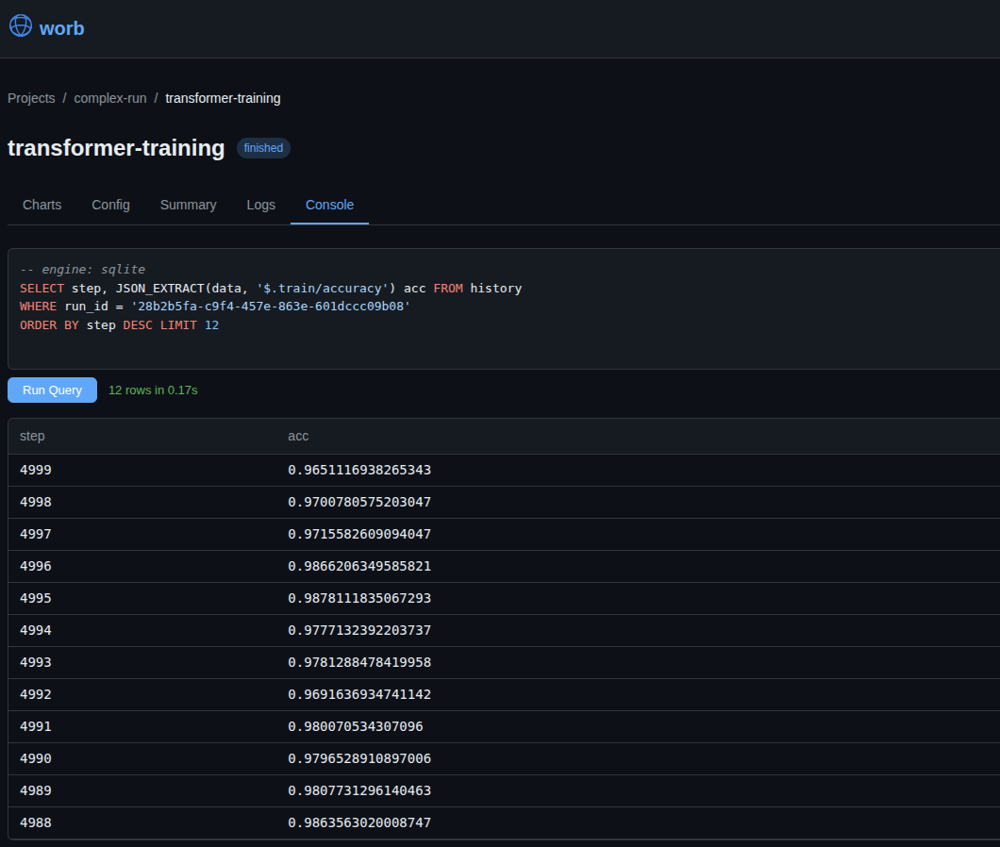
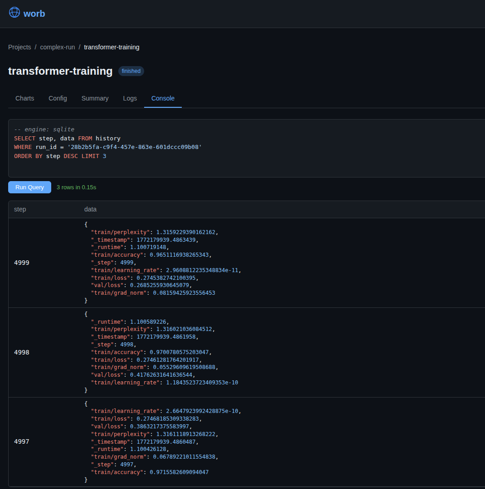

<p align="center">
  
</p>

# worb

https://worb.cloud

Local, single-binary server compatible with the standard `wandb` Python client. Also, a bad pun.

- **Powered by SQLite, Turso, or DuckDB**: single file, simple backups, built-in SQL console
- **Single executable**: build and run anywhere, just set `WANDB_BASE_URL=http://your-worb-server`
- **built-in GraphQL console**: for the men of culture

## Usage

```bash
./worb
```

```python
import os
import wandb

os.environ["WANDB_DIR"] = "worb"
os.environ["WANDB_BASE_URL"] = "http://localhost:8080"
os.environ["WANDB_API_KEY"] = "dev-"+"lo"*20+"_example"

wandb.init(project="test-project", name="test-run")
for i in range(100):
    wandb.log({"loss": 1.0 / (i + 1), "step": i})
wandb.finish()
```

Then visit `http://localhost:8080` to see the run with metrics charts.

## Examples

Run the example scripts in the `examples/` directory to see how things work:

```bash
WANDB_BASE_URL=http://localhost:8080 uv run --no-project --with wandb python examples/complex.py
WANDB_BASE_URL=http://localhost:8080 uv run --no-project --with wandb python examples/histogram.py
WANDB_BASE_URL=http://localhost:8080 uv run --no-project --with wandb python examples/out_of_order.py
```

## Benchmark

Stress-test worb by simulating a 650B MoE LLM training run on 10,240 GPUs, logging ~120-8,300 metrics per step (per-layer norms, per-expert utilization, per-node GPU stats):

```bash
# quick test (50 steps, small cluster)
uv run --no-project --with wandb python examples/bench_llm.py --steps 50 --num-nodes 10

# full stress test (50k steps, 1280 nodes)
uv run --no-project --with wandb python examples/bench_llm.py
```

See `python examples/bench_llm.py --help` for all options.

## Docker

```bash
docker run -v ~/.worb:/data -p 8080:8080 ghcr.io/psarna/worb --data /data
```

## Build

```bash
go build .
```

## Flags

| Flag | Default | Description |
|------|---------|-------------|
| `--host` | `127.0.0.1` | Host to bind to (use `0.0.0.0` for all interfaces) |
| `--port` | `8080` | Port to listen on |
| `--data` | `~/.worb` | Data directory for the database file and uploaded files |
| `--db-engine` | `sqlite` | Database engine: `sqlite`, `turso`, or `duckdb` |

## Turso

To use [Turso](https://turso.tech) as a hosted database:

```bash
TURSO_URL=libsql://your-db.turso.io TURSO_AUTH_TOKEN=your-token ./worb --db-engine turso
```

| Environment Variable | Required | Description |
|---------------------|----------|-------------|
| `TURSO_URL` | Yes | Turso database URL (`libsql://...`) |
| `TURSO_AUTH_TOKEN` | No | Auth token (not needed for local dev) |

## Backup

All data lives in a single file (`~/.worb/worb.db`, `~/.worb/worb.duckdb`). To back it up, just copy the file — no export tools or dump commands needed.

## Demo





