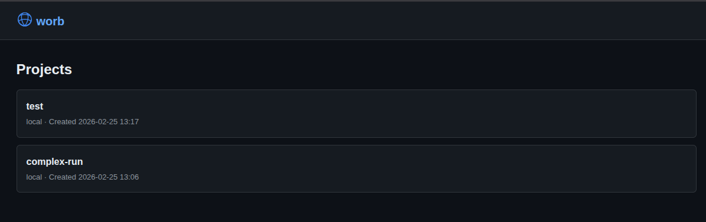
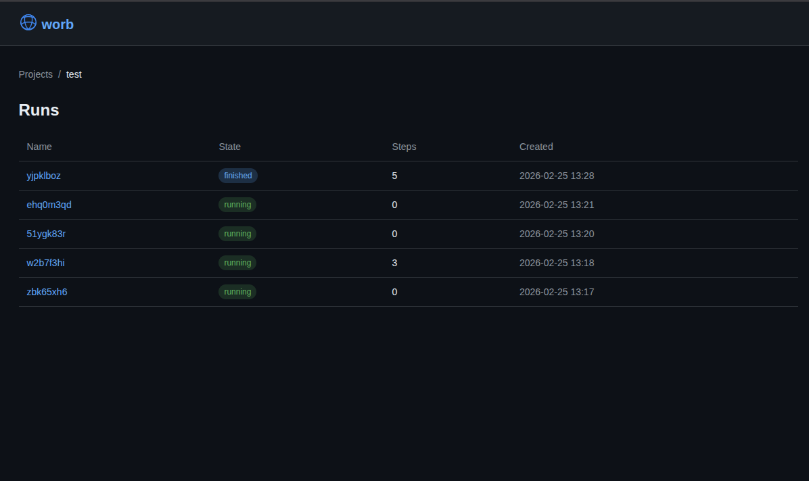
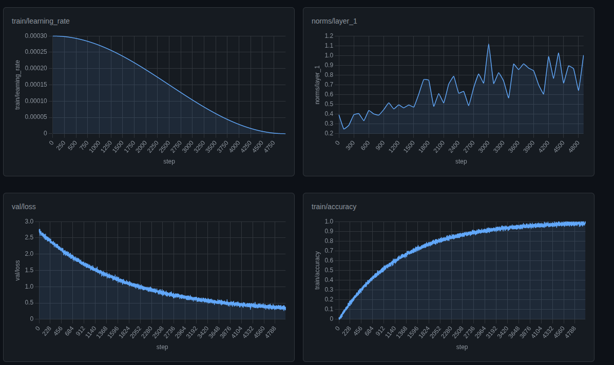

<p align="center">
  
</p>

# worb

https://worb.cloud

Local, single-binary server compatible with the standard `wandb` Python client. Also, a bad pun.

## Usage

```bash
./worb --port 8080 --data ~/.worb
```

```python
import os
import wandb

os.environ["WANDB_DIR"] = "worb"
os.environ["WANDB_BASE_URL"] = "http://localhost:8080"
os.environ["WANDB_API_KEY"] = "dev-"+40*"f"

wandb.init(project="test-project", name="test-run")
for i in range(100):
    wandb.log({"loss": 1.0 / (i + 1), "step": i})
wandb.finish()
```

Then visit `http://localhost:8080` to see the run with metrics charts.

## Build

```bash
go build -o worb .
```

## Flags

| Flag | Default | Description |
|------|---------|-------------|
| `--host` | `127.0.0.1` | Host to bind to (use `0.0.0.0` for all interfaces) |
| `--port` | `8080` | Port to listen on |
| `--data` | `~/.worb` | Data directory for DuckDB and uploaded files |

## Backup

All data lives in a single DuckDB file (`~/.worb/worb.duckdb`). To back it up, just copy the file — no export tools or dump commands needed.

## Demo






