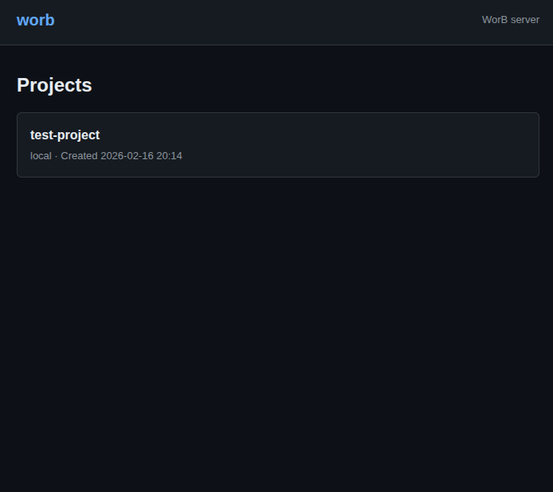
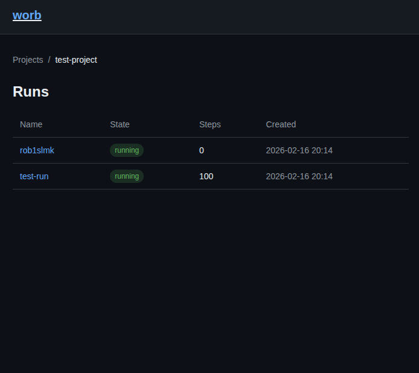
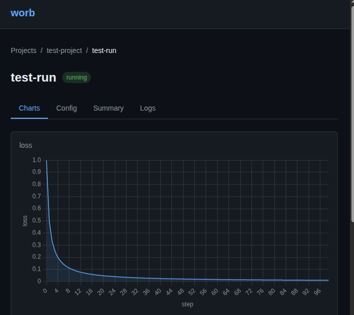
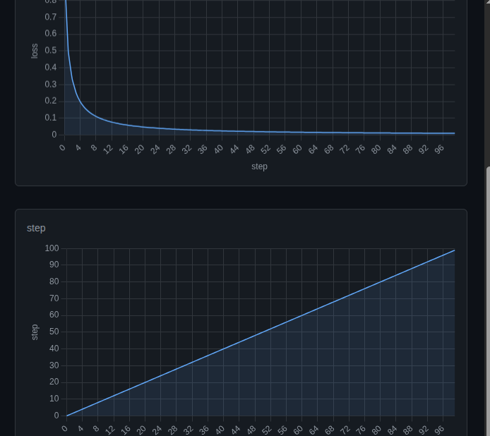

# worb

Local, single-binary server compatible with the standard `wandb` Python client. Also, a bad pun.

## Usage

```bash
./worb -port 8080 -data ~/.worb
```

```python
import wandb
import os

os.environ["WANDB_BASE_URL"] = "http://localhost:8080"
os.environ["WANDB_API_KEY"] = "local-dev-key"

wandb.init(project="test-project", name="test-run")
for i in range(100):
    wandb.log({"loss": 1.0 / (i + 1), "step": i})
wandb.finish()
```

Then visit `http://localhost:8080` to see the run with metrics charts.

## Build

```bash
go build -o worb .
```

## Flags

| Flag | Default | Description |
|------|---------|-------------|
| `-port` | `8080` | Port to listen on |
| `-data` | `~/.worb` | Data directory for DuckDB and uploaded files |

## Demo






